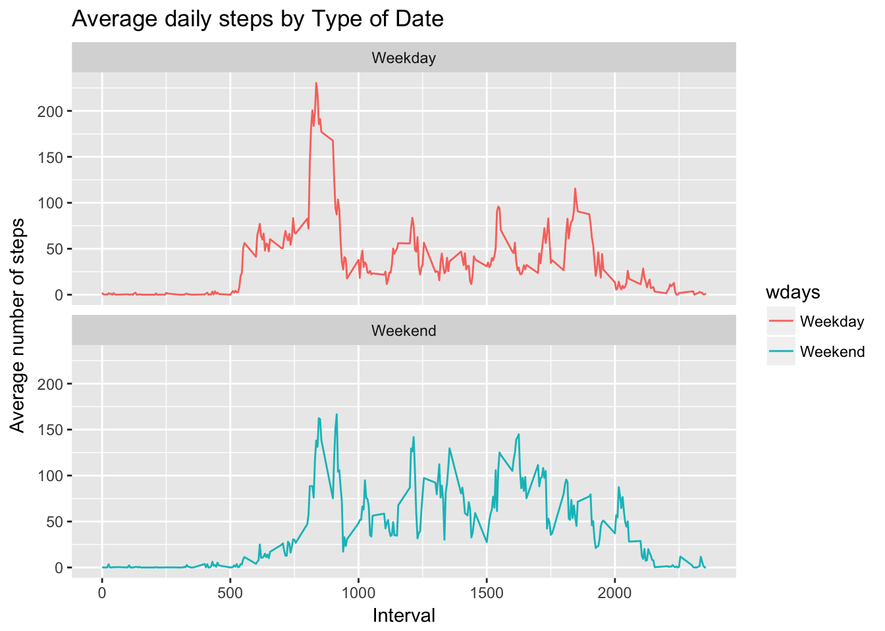

Load up Libraries
-----------------

    library(dplyr)
    library(ggplot2)

Step 1 :- Read in data from activity file, and get summary information on file etc
----------------------------------------------------------------------------------

    # read in the csv source file
    ds <- read.csv("activity.csv", stringsAsFactors = FALSE)
    # get number of rows and columns
    dim(ds)

    ## [1] 17568     3

    # get first 5 rows of dataset
    head(ds, n=5)

    ##   steps       date interval
    ## 1    NA 2012-10-01        0
    ## 2    NA 2012-10-01        5
    ## 3    NA 2012-10-01       10
    ## 4    NA 2012-10-01       15
    ## 5    NA 2012-10-01       20

    # get the last 5 rows of dataset
    tail(ds, n=5)

    ##       steps       date interval
    ## 17564    NA 2012-11-30     2335
    ## 17565    NA 2012-11-30     2340
    ## 17566    NA 2012-11-30     2345
    ## 17567    NA 2012-11-30     2350
    ## 17568    NA 2012-11-30     2355

    # get info on columns
    str(ds)

    ## 'data.frame':    17568 obs. of  3 variables:
    ##  $ steps   : int  NA NA NA NA NA NA NA NA NA NA ...
    ##  $ date    : chr  "2012-10-01" "2012-10-01" "2012-10-01" "2012-10-01" ...
    ##  $ interval: int  0 5 10 15 20 25 30 35 40 45 ...

    # get summary information on dataset
    summary(ds)

    ##      steps            date              interval     
    ##  Min.   :  0.00   Length:17568       Min.   :   0.0  
    ##  1st Qu.:  0.00   Class :character   1st Qu.: 588.8  
    ##  Median :  0.00   Mode  :character   Median :1177.5  
    ##  Mean   : 37.38                      Mean   :1177.5  
    ##  3rd Qu.: 12.00                      3rd Qu.:1766.2  
    ##  Max.   :806.00                      Max.   :2355.0  
    ##  NA's   :2304

Remove the NA values from dataset

    ds_na <- ds[complete.cases((ds)),]
    head(ds_na,n=20)

    ##     steps       date interval
    ## 289     0 2012-10-02        0
    ## 290     0 2012-10-02        5
    ## 291     0 2012-10-02       10
    ## 292     0 2012-10-02       15
    ## 293     0 2012-10-02       20
    ## 294     0 2012-10-02       25
    ## 295     0 2012-10-02       30
    ## 296     0 2012-10-02       35
    ## 297     0 2012-10-02       40
    ## 298     0 2012-10-02       45
    ## 299     0 2012-10-02       50
    ## 300     0 2012-10-02       55
    ## 301     0 2012-10-02      100
    ## 302     0 2012-10-02      105
    ## 303     0 2012-10-02      110
    ## 304     0 2012-10-02      115
    ## 305     0 2012-10-02      120
    ## 306     0 2012-10-02      125
    ## 307     0 2012-10-02      130
    ## 308     0 2012-10-02      135

    dim(ds_na)

    ## [1] 15264     3

    str(ds_na)

    ## 'data.frame':    15264 obs. of  3 variables:
    ##  $ steps   : int  0 0 0 0 0 0 0 0 0 0 ...
    ##  $ date    : chr  "2012-10-02" "2012-10-02" "2012-10-02" "2012-10-02" ...
    ##  $ interval: int  0 5 10 15 20 25 30 35 40 45 ...

Q1 : What is mean total number of steps taken per day?
======================================================

-   Calculate the total number of steps taken per day
-   Make a histogram of the total number of steps taken each day
-   Calculate and report the mean and median of the total number of
    steps taken per day

Following code will calculate total steps per day

    grp <- group_by(ds_na,date)
    sum_steps <- summarise(grp,sum(steps))
    head(sum_steps,n=5)

    ## # A tibble: 5 x 2
    ##   date       `sum(steps)`
    ##   <chr>             <int>
    ## 1 2012-10-02          126
    ## 2 2012-10-03        11352
    ## 3 2012-10-04        12116
    ## 4 2012-10-05        13294
    ## 5 2012-10-06        15420

    tail(sum_steps,n=5)

    ## # A tibble: 5 x 2
    ##   date       `sum(steps)`
    ##   <chr>             <int>
    ## 1 2012-11-25        11834
    ## 2 2012-11-26        11162
    ## 3 2012-11-27        13646
    ## 4 2012-11-28        10183
    ## 5 2012-11-29         7047

-   Make a histogram of the total number of steps taken each day

<!-- -->

    hist(x=sum_steps$`sum(steps)`,
         col="green",
         breaks=20,
         xlab="Daily - Total Steps",
         ylab="Frequency",
         main="Histogram of Total Number of steps daily")

-   Calculate and report the mean and median of the total number of
    steps taken per day

<!-- -->

    # Calculate median of total number of steps per day
    summarise(sum_steps,median(sum_steps$`sum(steps)`))

    ## # A tibble: 1 x 1
    ##   `median(sum_steps$\`sum(steps)\`)`
    ##                                <int>
    ## 1                              10765

Median = 10765

    # Calculate mean total number of steps taken per day
    summarise(sum_steps,mean(sum_steps$`sum(steps)`))

    ## # A tibble: 1 x 1
    ##   `mean(sum_steps$\`sum(steps)\`)`
    ##                              <dbl>
    ## 1                            10766

Mean = 10766

Q2:- What is the average daily activity pattern?
================================================

-   Make a time series plot (i.e. 𝚝𝚢𝚙𝚎 = "𝚕") of the 5-minute
    interval (x-axis) and the average number of steps taken, averaged
    across all days (y-axis)
-   Which 5-minute interval, on average across all the days in the
    dataset, contains the maximum number of steps?

<!-- -->

    grp <- group_by(ds_na,interval)
    meansteps <- summarise(grp,mean(steps))
    # meansteps$date <- as.Date(meansteps$date,'%Y-%m-%d')

    plot(meansteps$interval, 
         meansteps$`mean(steps)`, 
         type = "l", 
         las = 1, 
         col = "red", 
         main = "Avg Steps taken - Time Series",
         col.main = "blue",
         font.main = 4,
         xlab = "Daily Intervals",
         ylab = "Step Averages",
         xlim = c(min(meansteps$interval),max(meansteps$interval)))

-   Now find out where the maximum value occurred ...

<!-- -->

    # find out where the maximum value occurred
    meansteps[which.max(meansteps$`mean(steps)`),]

    ## # A tibble: 1 x 2
    ##   interval `mean(steps)`
    ##      <int>         <dbl>
    ## 1      835           206

Maximum average was 206, at interval 835

Q3 Imputing Missing Values
==========================

-   Calculate and report the total number of missing values in the
    dataset (i.e. the total number of rows with 𝙽𝙰s)
-   Devise a strategy for filling in all of the missing values in
    the dataset. The strategy does not need to be sophisticated. For
    example, you could use the mean/median for that day, or the mean for
    that 5-minute interval, etc.
-   Create a new dataset that is equal to the original dataset but with
    the missing data filled in.
-   Make a histogram of the total number of steps taken each day and
    Calculate and report the mean and median total number of steps taken
    per day. Do these values differ from the estimates from the first
    part of the assignment? What is the impact of imputing missing data
    on the estimates of the total daily number of steps?

<!-- -->

    nrow(ds)

    ## [1] 17568

    nrow(ds_na)

    ## [1] 15264

Therefore the number of missing observations is :- 17568 - 15264 = 2304.

Now addressing parts 2 and 3 of question (devise strategy to fill in
missing values, create dataset with missing values filled in)

    # create dataframe with all NA values for steps
    na_rows <- ds[is.na(ds),]
    # create dataframe with all records that do NOT have NA values
    notna_rows <- ds[complete.cases(ds),]
    # loop through na_rows and assign mean interval value for that day
    for(i in 1:nrow(na_rows)) {
        na_rows[i,1] <- meansteps$`mean(steps)`[meansteps$interval==na_rows[i,3]]
    }
    head(na_rows, n=5)

    ##       steps       date interval
    ## 1 1.7169811 2012-10-01        0
    ## 2 0.3396226 2012-10-01        5
    ## 3 0.1320755 2012-10-01       10
    ## 4 0.1509434 2012-10-01       15
    ## 5 0.0754717 2012-10-01       20

    # now create new dataframe and combine both previous dataframes, na_rows and notna_rows
    new_df <- rbind(na_rows,notna_rows)
    dim(new_df)

    ## [1] 17568     3

    head(new_df, n=5)

    ##       steps       date interval
    ## 1 1.7169811 2012-10-01        0
    ## 2 0.3396226 2012-10-01        5
    ## 3 0.1320755 2012-10-01       10
    ## 4 0.1509434 2012-10-01       15
    ## 5 0.0754717 2012-10-01       20

    tail(new_df, n=5)

    ##       steps       date interval
    ## 17276     0 2012-11-29     2335
    ## 17277     0 2012-11-29     2340
    ## 17278     0 2012-11-29     2345
    ## 17279     0 2012-11-29     2350
    ## 17280     0 2012-11-29     2355

Now creating a Histogram of total number of steps each day, for this new
dataset

    grp2 <- group_by(new_df,date)
    sum_steps_nf <- summarise(grp2,sum(steps))
    head(sum_steps_nf,n=5)

    ## # A tibble: 5 x 2
    ##   date       `sum(steps)`
    ##   <chr>             <dbl>
    ## 1 2012-10-01        10766
    ## 2 2012-10-02          126
    ## 3 2012-10-03        11352
    ## 4 2012-10-04        12116
    ## 5 2012-10-05        13294

    tail(sum_steps_nf,n=5)

    ## # A tibble: 5 x 2
    ##   date       `sum(steps)`
    ##   <chr>             <dbl>
    ## 1 2012-11-26        11162
    ## 2 2012-11-27        13646
    ## 3 2012-11-28        10183
    ## 4 2012-11-29         7047
    ## 5 2012-11-30        10766

    # create histrogram
    hist(x=sum_steps_nf$`sum(steps)`,
         col="red",
         breaks=20,
         xlab="Daily - Total Steps",
         ylab="Frequency",
         main="Histogram: Total Number of steps daily (new DataFrame)")

    # Calculate median of total number of steps per day
    summarise(sum_steps_nf,median(sum_steps_nf$`sum(steps)`))

    ## # A tibble: 1 x 1
    ##   `median(sum_steps_nf$\`sum(steps)\`)`
    ##                                   <dbl>
    ## 1                                 10766

    # Calculate mean total number of steps taken per day
    summarise(sum_steps_nf,mean(sum_steps_nf$`sum(steps)`))

    ## # A tibble: 1 x 1
    ##   `mean(sum_steps_nf$\`sum(steps)\`)`
    ##                                 <dbl>
    ## 1                               10766

Setting the NA values to the mean interval for that day, appears to have
made the distribution, (ie. histogram) more of a normal distribution.
Relating to the median + mean values, imnputing the values seems to have
had the effect of making them equal.

Q4. Are there differences in activity patterns between weekdays and weekends?
=============================================================================

-   For this part the 𝚠𝚎𝚎𝚔𝚍𝚊𝚢𝚜() function may be of some help here. Use
    the dataset with the filled-in missing values for this part.

-   Create a new factor variable in the dataset with two levels –
    “weekday” and “weekend” indicating whether a given date is a weekday
    or weekend day.
-   Make a panel plot containing a time series plot (i.e. 𝚝𝚢𝚙𝚎 = "𝚕") of
    the 5-minute interval (x-axis) and the average number of steps
    taken, averaged across all weekday days or weekend days (y-axis).
    See the README file in the GitHub repository to see an example of
    what this plot should look like using simulated data.

<!-- -->

    new_df$wdays <- weekdays(as.Date(new_df$date))
    for(i in 1:nrow(new_df)) {
        if (new_df[i,4] == "Saturday" | new_df[i,4] == "Sunday") {
            new_df[i,4] <- "Weekend"
        }
        else {
            new_df[i,4] <- "Weekday"
        }
    }
    head(new_df,n=5)

    ##       steps       date interval   wdays
    ## 1 1.7169811 2012-10-01        0 Weekday
    ## 2 0.3396226 2012-10-01        5 Weekday
    ## 3 0.1320755 2012-10-01       10 Weekday
    ## 4 0.1509434 2012-10-01       15 Weekday
    ## 5 0.0754717 2012-10-01       20 Weekday

    tail(new_df,n=5)

    ##       steps       date interval   wdays
    ## 17276     0 2012-11-29     2335 Weekday
    ## 17277     0 2012-11-29     2340 Weekday
    ## 17278     0 2012-11-29     2345 Weekday
    ## 17279     0 2012-11-29     2350 Weekday
    ## 17280     0 2012-11-29     2355 Weekday

    act_date <- aggregate(steps~interval + wdays, new_df, mean, na.rm = TRUE)
    plot<- ggplot(act_date, aes(x = interval , y = steps, color = wdays)) +
           geom_line() +
           labs(title = "Average daily steps by Type of Date", 
                        x = "Interval", 
                        y = "Average number of steps") +
                        facet_wrap(~wdays, ncol = 1, nrow=2)
    print(plot)

